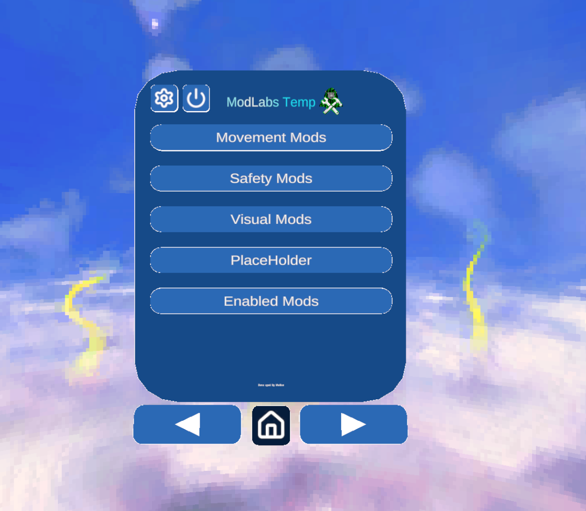

#  ModLabs Mod Menu Temp
## https://discord.gg/Tp2XKjSMN3
### A ready to go mod checker template without changing anyting

 

##  Installation

### How to use

1. Download the .zip file
2. Extract it
3. Locate the ModLabsMenuTemp folder keep on clicking it until you find ModLabs.sln
4. Double click ModLabs.sln
5. The rest of the steps on how to edit it is inside config.cs
6. Now hit the play green button at the top to build it
7. Gorilla tag should launch if it did then you fully got it working
8. Thats it have fun!
Pls do not remove the developer credits

---

---

##  Preview

---

